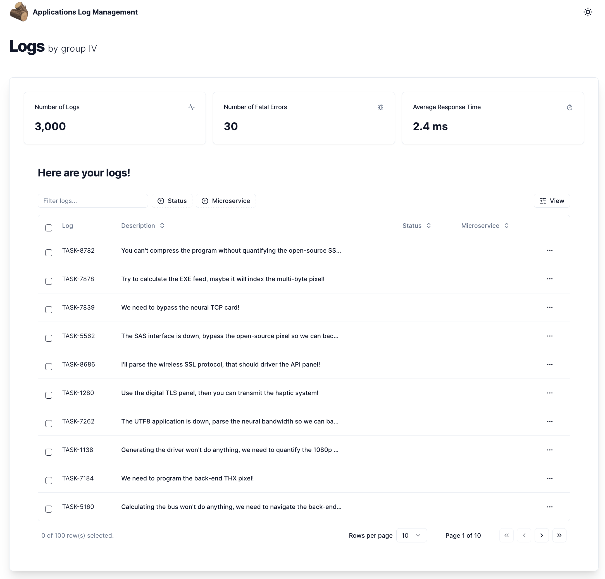

# Application Log Management

## How to run

This is a [Next.js 13](https://nextjs.org/) app. If you're unfamiliar with it, check out the [Next.js Documentation](https://nextjs.org/docs).

1. Clone the repo
2. Run `npm install`
3. Run `npm run dev` to start the development server

## Contributors

- Austin Nyagaka
- Margaret Karani
- Lynette Mwangi
- Melisa Michuki
- Teddy Mwai
- Cliff Ezra

